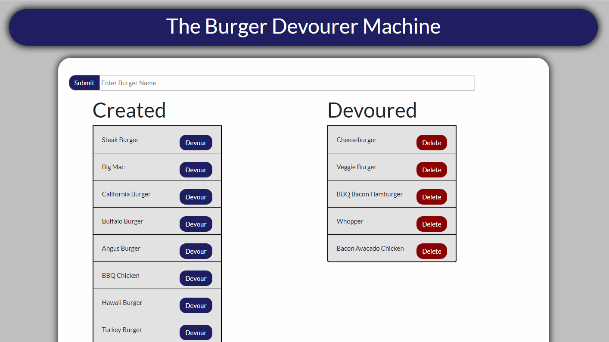

# NodeExpressHandlebars

Heroku Deployed App: https://burger-devourer-machine.herokuapp.com/

A gif of the app in use:



 ## Description 
A burger restaurant app that lets you order and then devour and delete burgers on a MySQL database. The app uses the Bootstrap CSS framework, a MySQL database, Node, Express, and Express-handlebars as the middleware. This app is built using a MVC pattern so that each functionality of the application is seperated into different directories/files. It has 5 layers that are described in the [MVC Design](#mvc-design) part of this README.md. The 5 links are listed as:

- [The Front End](#front-end): Includes the public and views directory
- [Routes](#routes): Includes the controllers directory
- [Models](#models): Includes the models directory
- [Configuration](#configuration): Includes the config directory 
- [Database](#database): Includes the db directory and/or the database itself
 
# Table of Contents 
- [MVC Design](#mvc-design)
- [Installation](#installation) 
- [Usage](#usage) 
- [Contribution](#contribution) 
- [Tests](#tests) 
- [License](#license) 
- [Questions](#questions)

# MVC Design
The MVC design seperates all of the functionality of the app into different layers of the app, which are listed in the [Description](#description) of this README.md. Each layer does something unique and contrubutes to the frontend communicating to the backend on how the user wants to change information on the database.

## Front End
The front end includes all HTML, CSS, and JavaScript that is used to make the app interactive between the user and the backend. The HTML is used in Express handlebars files that can be found in the "views" directory. The index.handlebars files includes the two bootstrap colums that each list of devoured burgers and created burgers.

There is also the main.handlebars file which includes the head of the HTML that imports all of the stylesheets, the header, and the footer of the front end. This would be ideal to use with larger applications with multiple HTML files that all have the same header/footer.

In the public directory, there is the assets directory which includes the CSS, JavaScrip, and the images that makes the front end work and makes it user friendly. The CSS contains all the same stuff that I use for my own poertfolio along with other projects so they all match. The IMG file contains an icon that is used in the header on the main.handlebars page. The JS direcory contains all the JavaScript that makes the jQuery button click events happen. The index.js file includes the Create burger button click event, the devour burger button click event, and the delete burger button click event along with the proper API calls that use AJAX to communicate with the backend. These AJAX API calls send/recieve these API requests directly to the [Routes](#routes) layer of the application. 

## Routes
In the controllers directory you can find the burger_controllers.js file which includes all of the API routes that generates the HTML on the [The Front End](#front-end) and gets/modifies information in the database in the backend. Here you can find a GET route "/" that generates the index.handlebars page which also pulls information from the database through the [Models](#models). This rout gets all of the burgers and then sorts them into 2 arrays: the createdBurgers array and the devouredBurgers. The createdBurgers array contains all of the burgers that have been created in the database but they have not yet been devoured. The devouredBurgers array contains all of the burgers in the database that have been devoured; this is done by checking weather the boolean row attribute is true or false (either 0 or 1).

The post API route simply gets the name of the burger that the user wants to create and then stores it into the database by creating a new row for that burger. The put API route changes the database so that the requested burger is listed as "devoured". The devour attribute is the only attribute that you can change in this application. The delete route permanently deletes the request burger from the database. Only devoured burgers are given a delete button, so only devoured burgers can be deleted. All of these routes send their requests and recieve information from the [Models](#models) layer instead of directly from the database.

## Models
In the mdoels layer there can be found the burger.js file which transfers information to and from the controllers in the [Routes](#routes) layer to the ORM (Object Relational Mapping) which is in the [Configuration](#configuration) layer. This layer has 4 functions: all, create, update, and delete. The all function gets all of the burgers from the ORM. The create function submits a burger to be created in the ORM. The update requests that a burger status is updated to be devoured in the ORM. The delete function submits a request to the ORM for a burger to be deleted.

## Configuration
The config directory contains the configuration layer which is the layer that actually connects with and interacts with the database. The connection.js file makes the actual MySQL connection with the database by providing a DB name, a username, a password, and a host (which are all [Heroku](https://www.heroku.com/home) environment variables but can be changed to fit a local database on your computer). The Heroku database uses a remote database provided by [JawsDB](https://elements.heroku.com/addons/jawsdb) which is a Heroku extension. The MySQL login information is stored and defined on the Heroku repository and can only be used there.

The ORM.js file contains all of the ORM functions that make actual SQL queries to the database to view, create, update, and delete the burgers in the database. It contains for functions: selectAll, insertOne, updateOne, and deleteOne. All of these functions listed passes through a variable which is a cb (Callback) function that calls back to the models and the controllers layer for the information requests. The CB function sends back the updated information to the models layer, and then to the controller/routes layer so that it can interact with the front end. For example, the selectAll function sends a request to get all of the information from the database, then it sends a callback that contains that information to be displayed on the front end. The insertOne function recieves a request to create a burger by passing in a burger name, and then it sends a callback function with the new burger ID. The updateOne and deleteOne functions work in a similar fasion, they pass through an ID of a burger to be updated/deleted. The only difference here is that the updateOne function updates a burger status to devoured and the deleteOne functions deletes the burger from the database.

These callback functions all send callback functions back to the [Models](#models) layer and the [Routes](#routes) layer so that the front end make update it's own information according to the database.

## Database
The database layer is the last but not least layer, it contains the actual database that stores information. The database name in this example is "burgers_db" and it contains one table called the burgers table. A layout of the table can be fount in the [DB directory inside the Schema SQL file](/db/schema.sql). The table has three rows: an id (primary key), a burger name, and a boolean status of weather or not the burger has been devoured. You can find some premade burgers and add them to your own local DB in the [Seeds SQL file inside the DB directory](/db/seeds.sql) 

## Installation 
To install, run the following command:

```
npm i
```

## Usage
For adding and removing information from a MySQL database on Heroku. This app was built for education purposes.

To use, run the following command to run the app: 

```
npm start
```

## License 
This application is covered by: NPM Package
 
## Contribution 
Contact me using the info in questions
 
## Tests 
```
npm start
```
 
## Questions 
If you have any questions feel free to contact: 
 
[GitHub](https://github.com/vmcgargill) 
 
Email: [vincentmcgargill@gmail.com](mailto:vincentmcgargill@gmail.com)
